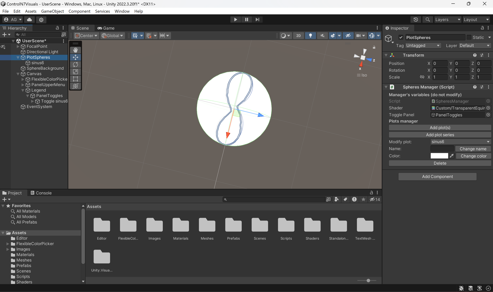
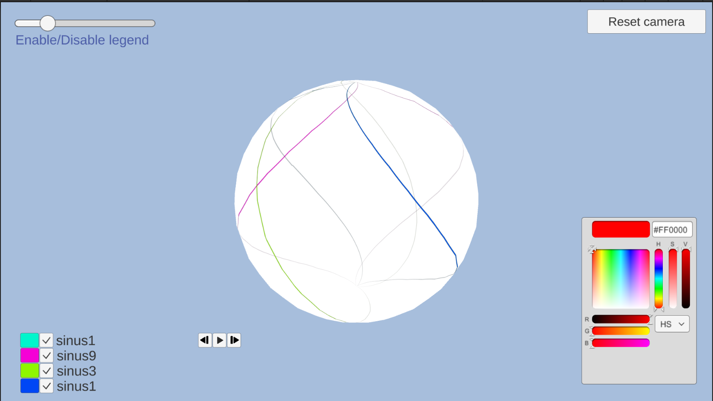

# Description

ControlN7Visuals is a Unity project specifically developed for the sake of 3D-visualizing optimal
control solutions. It offers a premade Unity scene with custom editor inspector: the user selects solution graphs from the Unity editor and they automatically get added onto a sphere. The project can then be built in order to get a visual demonstration web module, for example.

# Setting up

1. Open new project

Open Unity Hub and click on "New project" and choose "3D (Built-in Render Pipeline)" template, choose fitting name for your project and click on "Create project".

2. Copy repository's folders

Copy files from folders "Assets", "Packages" and "ProjectSettings" from this repository into the empty folders newly created in your Unity Project.

3. Choose compatible build platform

Make sure the editor's selected build platform is "PC". To do so, go in File - Build Settings - Platform: "Windows, Mac Linux" should be selected. If not, select it and click on "Switch Platform". If the editor's build platform is anything else, you won't be able to import several files at the same time and other editing features might be affected. Of course, after having finished editing, you can choose whatever platform you prefer to build the application.

# How to use ControlN7Visuals ?

## Plot graphs

To plot the graphs needed for your visualization, prefer using the parameters given by the file julia_template.jl found in root of the repository. For the mapping onto the sphere to work, the graphs have to be PNG files with 2:1 ratio and transparent background, with no borders. See example below.

## Edit the scene

### Add and edit plots

When in editor mode, you can add and edit plots by opening the PlotSphere's custom inspector. To do so, select the parent GameObject PlotSphere by clicking on it in the hierarchy panel (by default on the left side of the screen).

On the right side of the panel, the custom inspector opens.

You can then click on "Add plots" to select the plots you want to visualize on the sphere. If you click on "Add plot series", you'll be able to choose graphs that will be played in order, every few frames, as an animation.
\
The plot is then added as a child of PlotSphere and you can edit its name and color or delete it from the inspector.

Please prefer using the delete button in the inspector rather than deleting it from the hierarchy panel as it may result in errors. If you need to delete from the the hierarchy panel, make sure you also delete the toggle associated to it that's been added to Canvas/Legend/PanelToggles children. This remark applies to the other possible modifications aswell.

### Other modifiable parameters

+ Scene background color: in the hierarchy panel, select FocalPoint/MainCamera ; in the inspector, select the desired color in the camera component "Background" color field.
+ Default hidden lines transparency rate: in the hierarchy panel, select Canvas/PanelUpperMenu/SliderAlphaBack ; in the inspector, write the desired value in the slider component "Value" field.
+ Animation speed: in the PlotSphere custom inspector, choose the delta time between each frame (note that it only     affects plot added afterwards).

### IMPORTANT

When done with editing the scene, don't forget to save it by clicking on the three dots next to its name in the hierarchy panel and then select "Save scene". It is important to note that simply pressing Ctrl+S doesn't save the scene.

## Runtime state

When running the application, the user can interact with the scene you've created. They can:

+ Orbit around the sphere (left click + drag), pan (right click + drag) and zoom (moousewheel).

+ Reset the camera.

+ Change the level of the hidden lines' transparency.

+ Change the color of a graph by selecting a color in the colorpicker and then clicking on the colored square next to the caption of the desired graph.

+ Change the caption by clicking on it and writing the new name.

+ Hide/Show a specific graph by clicking on the toggle button next to the caption of the desired graph.

+ Hide/Show the legend.

+ Play (automatically or manually) any graph's animation with the buttons next to its caption.